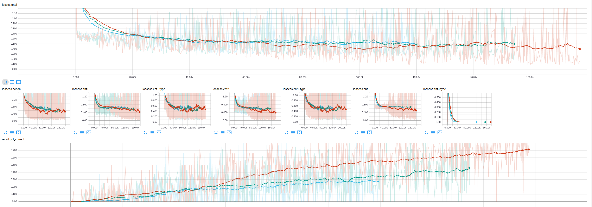
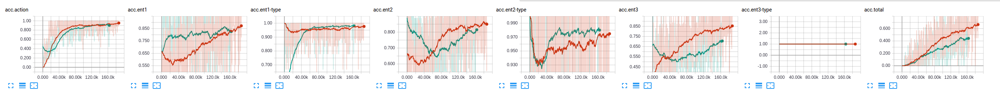

# Fun-With-Dnc (Differentiable Neural Computing)

Pytorch implementation of deepmind paper [Hybrid computing using a neural network with dynamic external memory]: https://pdfs.semanticscholar.org/7635/78fa9003f6c0f735bc3250fc2116f6100463.pdf. The code is based on the tensorflow implementation [here]: https://github.com/deepmind/dnc. 

## Problems and Expirements
There are a few tasks setup. One is the  "Air Cargo Prolbem" from Arificial Intelligence (Russell & Norvig). The origional code for the problem is based on the [Udacity Implementation]: https://github.com/udacity/AIND-Planning , and the full description is in the problem repo. 

The Air Cargo problem can be seen as structured prediction, (every prediction step can be seen as changing the state of the problem). The algorithms used to solve it in the book included graphplan, and Astar search of the state space, putting it in the same family of problems as the Blocks Problem (SHRDLU) solved in the origional paper. 

## Installation
Requires pytorch (no cuda)

        conda install pytorch torchvision cuda80 -c soumith

## Tensorboard
Run tensorboard with "--log 10" flag (the number is logging frequency). Below is a shot during training. Losses are recorded seperately for each entity and type, as well as the action for more addictive monitoring. 

To run with tensorboard:
        pip install tensorboardX (for tensorboard)
        pip install tensorflow (for tensorboard web server)

## Training Scenarios
### Planning
The code implements a training schedule as in the paper. Start small with the minimum sized problem (2 entities of each kind)

        python run.py --act plan --iters 1000  --ret_graph 1 --zero_at step --n_phases 20 --opt_at step
        python run.py --act plan --iters 1000  --ret_graph 1 --zero_at step --n_phases 20 --opt_at step --save opt_zero_step
        python run.py --act plan --iters 1000  --ret_graph 0 --opt_at problem --save opt_problem_plan --n_phases 20

 We humans would think about the problem in terms of actions and type, so I thought the first thing the DNC would start getting correct would be the (Action, typeofthing1, typeofthing2, typeofthing3) 'tuple', since those must be correct in order to reliably get the instance correct. This was indeed the case as can be seen on the 'accuracies' plots during training. By the scemantics of the problem, the last 'type' is always Airplane, so that goes to 100% accuracy immediately. The next chunk of 1/3td of the training bumps up the types to 0.9-1.0 range. Only then does the loss for the entities themselves start dropping consistently. Even then, the ent1 and ent3 were coupled, which in the logic of the problem...

### Question Answering
Another task that would be interesting I figured would be to give the DNC a problem (initial state, and goal), then make some moves, and ask where a certain Cargo is (which airport is it in? is it in a plane? which plane?). This did not work too well. See the run.py train_qa function. 

        python run.py --act qa --iters 1000 --n_phases 20

## Training Misc
### Other Problems
In an initial pass I tested with the sequence Memorization task from the deepmind repo. I have not tested it recently and I doubt it works (see todo). To run this specify the wit the problem 

### Other Setups
The DNC was tested against vanilla Lstms. The Lstm appears to get stuck on air cargo problem at ~40%. To run the training with LSTM only specify with '--algo LSTM' flag like so: 

        python run.py --act plan --algo lstm --iters 1000 --n_phases 20 

### Misc
Training at each 'level' took 20K steps. This is way more than reported in the paper. On my crappy home CPU, this meant about a day, aka forever. Since I also lost my computer, causing me to need to retrain everything, I only got through the first level of training before having to submit (2 airports, 2 cargos, 2 planes). 

## Differences from Original
There was some expirementation here, so there are a bunch of flags on when to optimize. In the paper they calculated loss at end of each problem. This did not work for me, so I ended up with running the optimzer after each response.

## Loading Previous Run  
        
        python run.py --act plan --iters 1000 --n_phases 20 --load the_saved_name_or_path --save the_new

## Flags

## Running on floydhub
Set the --env flag to floyd. When it gets up there, the script will create all the directories in /output. Tensorboard for pytorch does not appear to work on there for reasons I do not understand.

        floyd run --env pytorch-0.2 --tensorboard "bash setup.sh && python run.py --act dag --iters 1000 --env floyd"

## Todo
Upload best models
Test the sequence memorization task. probably does not work.
Implement with GPU. 
Testing on moar problems.
Dec02_00-48-05_psavine-G20AJ

